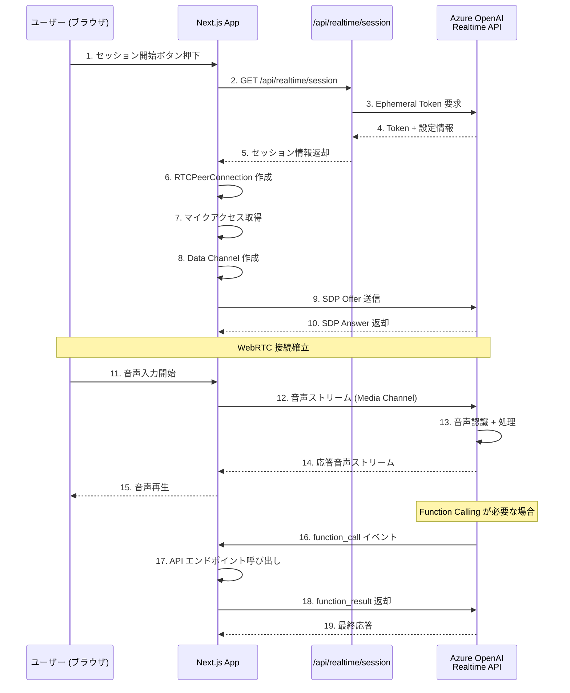
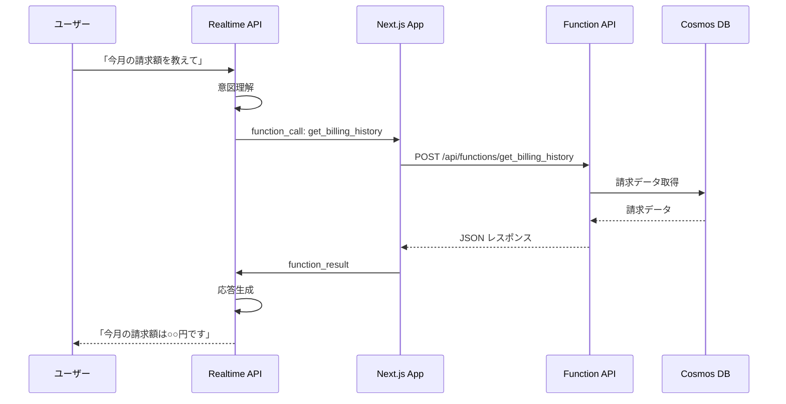

# Azure OpenAI Realtime API で実現する次世代音声対話エージェント
## 電力会社カスタマーサポートを例にした WebRTC 活用 PoC

---

## はじめに

本記事では、**Azure OpenAI Realtime API** と **WebRTC** を活用した音声対話エージェントの実装について解説します。電力会社のカスタマーサポートシステムを例に、従来のアプローチとの違い、アーキテクチャ、そして実装のポイントを詳しく説明します。

### 想定シーン：電力会社カスタマーサポート

電力会社のコールセンターには、日々多くの問い合わせが寄せられます：

- 「今月の請求金額を教えてください」
- 「料金プランを変更したいのですが」
- 「現在の電気使用量を確認したい」
- 「契約内容を確認したい」

これらの問い合わせに対して、従来は以下のような対応が行われてきました：

1. **IVR（自動音声応答）システム** - 番号入力による選択式メニュー
2. **オペレーター対応** - 人手による個別対応
3. **チャットボット** - テキストベースの自動応答

しかし、これらには課題があります：

| 方式 | 課題 |
|------|------|
| IVR | 複雑な問い合わせに対応できない、操作が煩雑 |
| オペレーター | コスト高、待ち時間、営業時間の制限 |
| チャットボット | 音声での対話ができない、高齢者に不向き |

**音声 AI エージェント**は、これらの課題を解決する可能性を持っています。

---

## 従来のアプローチ vs Realtime API

### 従来のアプローチ：STT → LLM → TTS

従来の音声対話システムは、以下のように複数のサービスを組み合わせて構築されていました：

```
┌─────────┐    ┌─────────┐    ┌─────────┐    ┌─────────┐    ┌─────────┐
│  ユーザー │ → │   STT   │ → │   LLM   │ → │   TTS   │ → │ スピーカー │
│（音声入力）│    │(音声→テキスト)│    │(テキスト処理)│    │(テキスト→音声)│    │（音声出力）│
└─────────┘    └─────────┘    └─────────┘    └─────────┘    └─────────┘
                  300ms+         500ms+         300ms+
                          合計: 1秒以上のレイテンシ
```

#### 従来アプローチの課題

1. **高いレイテンシ**
   - 各ステップで処理時間が発生
   - 合計で1〜3秒以上の遅延が生じる
   - 自然な会話リズムが損なわれる

2. **割り込み対応の困難さ**
   - ユーザーが途中で話し始めても検知が難しい
   - AI の発話を止めるタイミングが遅れる

3. **コンテキストの分断**
   - 音声の抑揚、感情が失われる
   - テキストへの変換で情報が欠落

4. **複雑なシステム構成**
   - 複数サービスの連携が必要
   - 障害ポイントが増加

### Realtime API + WebRTC のアプローチ

Azure OpenAI Realtime API は、**音声入力から音声出力までをエンドツーエンドで処理**します：

```
┌─────────┐         ┌─────────────────────────┐         ┌─────────┐
│  ユーザー │ ←WebRTC→ │  Azure OpenAI          │         │         │
│（ブラウザ）│         │  gpt-4o-realtime       │ ←API→   │  バックエンド │
└─────────┘         │  (音声→理解→音声)         │         │         │
                    └─────────────────────────┘         └─────────┘
                         〜200ms以下の低レイテンシ
```

#### Realtime API の優位性

| 項目 | 従来アプローチ | Realtime API |
|------|--------------|--------------|
| レイテンシ | 1〜3秒 | 200ms以下 |
| 割り込み対応 | 困難 | ネイティブ対応 |
| 音声品質 | 変換ロスあり | 高品質維持 |
| システム構成 | 複数サービス | 単一エンドポイント |
| Function Calling | 別途実装が必要 | ネイティブサポート |

---

## システムアーキテクチャ

### 全体構成図

```mermaid
flowchart TB
    subgraph Client ["クライアント (ブラウザ)"]
        UI[Next.js フロントエンド]
        MIC[マイク]
        SPK[スピーカー]
    end

    subgraph Azure ["Azure Cloud"]
        subgraph AOI ["Azure OpenAI Service"]
            RT[gpt-4o-realtime-preview<br/>Realtime API]
        end

        subgraph DB ["Azure Cosmos DB"]
            CUST[(customers)]
            BILL[(billings)]
            USAGE[(usages)]
            PLAN[(plans)]
            CHG[(plan_change_requests)]
        end
    end

    subgraph Backend ["Next.js バックエンド"]
        SESSION[/api/realtime/session/]

        subgraph Functions ["Function Endpoints"]
            F1[get_customer_info]
            F2[get_billing_history]
            F3[get_current_usage]
            F4[list_available_plans]
            F5[simulate_plan_change]
            F6[submit_plan_change_request]
        end
    end

    MIC -->|音声入力| UI
    UI <-->|WebRTC<br/>Audio + Data Channel| RT
    SPK <--|音声出力| UI

    UI -->|1. セッション要求| SESSION
    SESSION -->|2. Ephemeral Token| UI

    RT <-->|Function Calling| Functions

    Functions <--> CUST
    Functions <--> BILL
    Functions <--> USAGE
    Functions <--> PLAN
    Functions <--> CHG

    style RT fill:#0078D4,color:#fff
    style UI fill:#68217A,color:#fff
    style DB fill:#00A36C,color:#fff
```

### WebRTC 接続フロー



---

## 電力会社サポートエージェントの機能

本 PoC では、以下の6つの機能（ツール）を AI エージェントに提供しています：

### 1. 顧客情報取得 (get_customer_info)

顧客IDまたは電話番号から顧客情報を検索し、契約内容を取得します。

**取得できる情報：**
- 顧客名、住所、電話番号
- 契約プラン、契約アンペア
- メーター種別（従来型/スマートメーター）
- 契約開始日

### 2. 請求履歴照会 (get_billing_history)

過去の請求情報を照会します。

**取得できる情報：**
- 請求年月
- 使用量 (kWh)
- 請求金額
- 支払い状況

### 3. 現在使用量確認 (get_current_usage)

スマートメーター設置済みの顧客のみ、当月のリアルタイム使用量を確認できます。

**取得できる情報：**
- 当月の累計使用量
- 前日までの日別使用量
- 前月同時期との比較

### 4. プラン一覧表示 (list_available_plans)

利用可能な電力プランの一覧を表示します。

**プラン例：**
| プラン名 | 特徴 |
|---------|------|
| 従量電灯B | 一般家庭向け標準プラン |
| スマートエコプラン | 時間帯別料金、スマートメーター必須 |
| グリーンプラスプラン | 再生可能エネルギー100% |
| ファミリーバリュープラン | 大家族向け、使用量が多いほどお得 |

### 5. プラン変更シミュレーション (simulate_plan_change)

現在のプランから別プランに変更した場合の料金を試算します。

**シミュレーション内容：**
- 過去の使用実績に基づく料金比較
- 月額差額の試算
- 年間での予想節約額/増加額

### 6. プラン変更申込 (submit_plan_change_request)

プラン変更の申込を受け付けます。

**処理内容：**
- 申込情報の登録
- 受付番号の発行
- 変更予定日の通知

---

## 技術的な実装ポイント

### 1. セッション管理と認証

Realtime API への接続には **Ephemeral Token** を使用します。これは短期間のみ有効なトークンで、クライアントサイドで安全に使用できます。

```
[セッション作成フロー]
1. クライアント → サーバー: セッション要求
2. サーバー → Azure: API Key を使用してトークン要求
3. Azure → サーバー: Ephemeral Token 発行
4. サーバー → クライアント: Token 返却（API Key は非公開）
5. クライアント → Azure: Token を使用して WebRTC 接続
```

**セキュリティ上の利点：**
- API Key がクライアントに露出しない
- トークンは短時間で失効
- セッションごとに新しいトークンを発行

### 2. WebRTC の2つのチャネル

WebRTC 接続では、2種類のチャネルを使用します：

| チャネル | 用途 | データ形式 |
|---------|------|----------|
| Media Channel | 音声の送受信 | オーディオストリーム |
| Data Channel | イベント・制御メッセージ | JSON |

**Data Channel で送受信される主なイベント：**

```
[クライアント → Azure]
- conversation.item.create: ユーザー入力の送信
- response.create: AI 応答の要求

[Azure → クライアント]
- conversation.item.input_audio_transcription.completed: 音声認識結果
- response.audio_transcript.delta: AI 応答のテキスト（差分）
- response.function_call_arguments.done: Function Call の引数
- response.done: 応答完了
```

### 3. Function Calling の実装

AI エージェントがバックエンドの API を呼び出す仕組みです：



**Function 定義例：**

```javascript
{
  type: "function",
  name: "get_billing_history",
  description: "顧客の請求履歴を取得します",
  parameters: {
    type: "object",
    properties: {
      customer_id: {
        type: "string",
        description: "顧客ID（例: C-001）"
      },
      months: {
        type: "number",
        description: "取得する月数（デフォルト: 6）"
      }
    },
    required: ["customer_id"]
  }
}
```

### 4. 音声認識と応答の低レイテンシ

WebRTC が低レイテンシを実現できる理由：

1. **UDP ベースの通信**
   - TCP のような再送制御のオーバーヘッドがない
   - パケットロスがあっても継続

2. **メディア最適化**
   - 音声コーデック（Opus）による効率的な圧縮
   - 適応的ビットレート制御

3. **P2P に近い通信**
   - Azure のエッジサーバーへの直接接続
   - 中継サーバーを最小化

4. **VAD（Voice Activity Detection）**
   - 発話の開始/終了を自動検出
   - 割り込み（バージイン）にネイティブ対応

---

## データモデル

### Cosmos DB コンテナ構成

| コンテナ | パーティションキー | 用途 |
|---------|------------------|------|
| customers | /customerId | 顧客・契約情報 |
| billings | /customerId | 月次請求データ |
| usages | /customerId | 使用量データ |
| plans | /planType | 電力プランマスタ |
| plan_change_requests | /customerId | プラン変更申込 |

### サンプルデータ

PoC では以下のサンプルデータを使用：

**顧客データ（3名）：**
- 野村宏樹 (C-001) - 従量電灯B、スマートメーター
- 佐藤花子 (C-002) - スマートエコプラン、スマートメーター
- 鈴木一郎 (C-003) - 従量電灯B、従来メーター

**電力プラン（4種類）：**
- 従量電灯B
- スマートエコプラン
- グリーンプラスプラン
- ファミリーバリュープラン

---

## デモ構成

### ローカル環境での実行

```bash
# 依存関係のインストール
npm install

# 環境変数の設定（.env.local）
AZURE_OPENAI_ENDPOINT=https://your-resource.openai.azure.com
AZURE_OPENAI_API_KEY=your-api-key
AZURE_OPENAI_DEPLOYMENT=gpt-4o-realtime-preview

# 開発サーバーの起動
npm run dev

# ブラウザでアクセス
# http://localhost:3000/realtime
```

### 対話例

```
ユーザー: 「こんにちは、請求額を確認したいのですが」

AI: 「かしこまりました。ご本人確認のため、
      お客様番号か電話番号を教えていただけますか？」

ユーザー: 「電話番号は 090-1234-5678 です」

AI: 「ありがとうございます。野村宏樹様ですね。
      今月の請求額は 8,450円、使用量は 285kWh です。
      詳しい内訳や過去の請求履歴もお伝えできますが、
      いかがいたしましょうか？」

ユーザー: 「プランを変更するとどうなりますか？」

AI: 「現在のご契約は従量電灯Bプランですね。
      他のプランに変更した場合の料金シミュレーションを
      いたしましょうか？スマートエコプランやグリーンプラスプランが
      お選びいただけます。」
```

---

## 制限事項と考慮点

### 現在の制限

1. **リージョン制限**
   - East US 2 および Sweden Central のみで利用可能
   - 日本リージョンは未対応（2024年12月時点）

2. **モデルのプレビュー状態**
   - `gpt-4o-realtime-preview` はプレビュー版
   - SLA の対象外
   - 本番利用は慎重に検討が必要

3. **コスト**
   - 音声入出力の両方に課金
   - 通常の GPT-4o より高コスト
   - 長時間の対話では注意が必要

### セキュリティ考慮事項

1. **Ephemeral Token の管理**
   - サーバーサイドで発行
   - クライアントへの API Key 露出を防止

2. **個人情報の取り扱い**
   - 顧客情報は Azure 内で処理
   - 音声データの保存ポリシーを確認

3. **アクセス制御**
   - Function API へのアクセス制限
   - 本人確認フローの実装

---

## まとめと今後の展望

### 本 PoC で実現したこと

1. **低レイテンシ音声対話**
   - WebRTC による自然な会話体験
   - 従来の STT→LLM→TTS の限界を突破

2. **業務システム連携**
   - Function Calling によるバックエンド統合
   - 顧客データベースとのリアルタイム連携

3. **実用的なユースケース**
   - 電力会社カスタマーサポートの自動化
   - 請求確認からプラン変更まで一貫対応

### 今後の可能性

- **マルチモーダル対応**: 画像認識との組み合わせ
- **感情認識**: 音声から顧客の感情を分析
- **多言語対応**: 日本語以外の言語サポート
- **オンプレミス連携**: 既存システムとの統合

### 活用が期待される業界

| 業界 | ユースケース |
|------|-------------|
| 金融 | 口座照会、取引確認、商品説明 |
| 医療 | 予約受付、症状聞き取り、服薬指導 |
| 小売 | 注文受付、在庫確認、商品案内 |
| 交通 | 予約変更、運行情報案内 |
| 行政 | 手続き案内、申請受付 |

---

## 参考リンク

- [Azure OpenAI Realtime API ドキュメント](https://learn.microsoft.com/en-us/azure/ai-foundry/openai/how-to/realtime-audio-webrtc)
- [WebRTC API (MDN)](https://developer.mozilla.org/ja/docs/Web/API/WebRTC_API)
- [Azure Cosmos DB ドキュメント](https://learn.microsoft.com/ja-jp/azure/cosmos-db/)
- [Next.js ドキュメント](https://nextjs.org/docs)

---

*本記事は Azure コミュニティイベント登壇資料として作成されました。*
